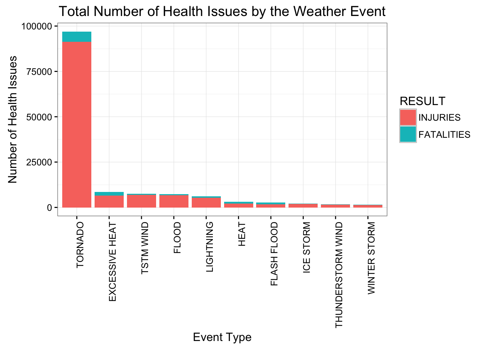
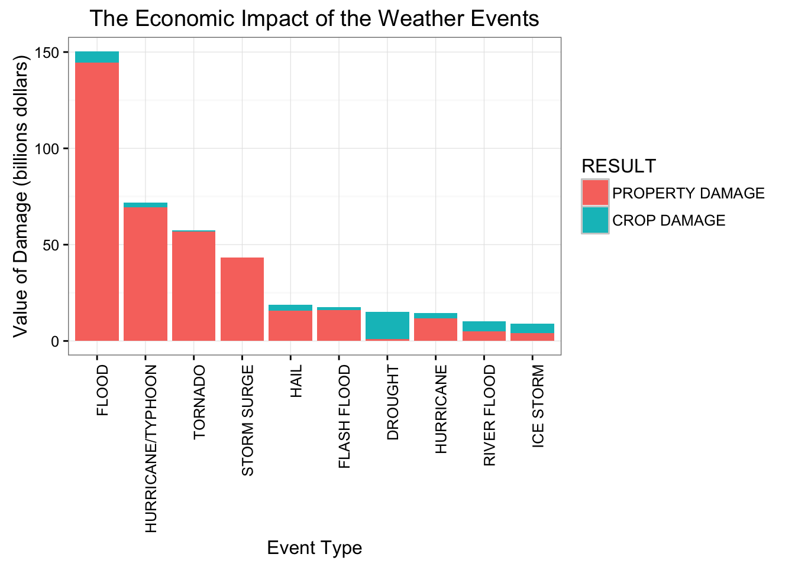

## Synopsis

In this report we aim to find what weather events have the biggest impact on the population health and economic issues in the US. The data used covers years from 1950 to 2011 and has been obtained from U.S. National Oceanic and Atmospheric Administration's (via Coursera website). From this data we found that tornadoes were the largest cause of health issues (fatalities, injuries) and floods caused the biggest overall damage properties and crops.


## Data Loading 

Data used in this analysis have been downloaded from the [Coursera Reproducible Research Website][1]. On this website there are also links to the detailed description of the data set. 

First, we read the data.


```r
stormData <- read.csv("./data/repdata_data_StormData.csv.bz2", header = TRUE,  stringsAsFactors = FALSE)
```

## Data Processing

After reading in the whole set, we check how many observations are there and then check the structure of the data frame.


```r
dim(stormData)
```

```
## [1] 902297     37
```


```r
str(stormData, 10)
```

```
## 'data.frame':	902297 obs. of  37 variables:
##  $ STATE__   : num  1 1 1 1 1 1 1 1 1 1 ...
##  $ BGN_DATE  : chr  "4/18/1950 0:00:00" "4/18/1950 0:00:00" "2/20/1951 0:00:00" "6/8/1951 0:00:00" ...
##  $ BGN_TIME  : chr  "0130" "0145" "1600" "0900" ...
##  $ TIME_ZONE : chr  "CST" "CST" "CST" "CST" ...
##  $ COUNTY    : num  97 3 57 89 43 77 9 123 125 57 ...
##  $ COUNTYNAME: chr  "MOBILE" "BALDWIN" "FAYETTE" "MADISON" ...
##  $ STATE     : chr  "AL" "AL" "AL" "AL" ...
##  $ EVTYPE    : chr  "TORNADO" "TORNADO" "TORNADO" "TORNADO" ...
##  $ BGN_RANGE : num  0 0 0 0 0 0 0 0 0 0 ...
##  $ BGN_AZI   : chr  "" "" "" "" ...
##  $ BGN_LOCATI: chr  "" "" "" "" ...
##  $ END_DATE  : chr  "" "" "" "" ...
##  $ END_TIME  : chr  "" "" "" "" ...
##  $ COUNTY_END: num  0 0 0 0 0 0 0 0 0 0 ...
##  $ COUNTYENDN: logi  NA NA NA NA NA NA ...
##  $ END_RANGE : num  0 0 0 0 0 0 0 0 0 0 ...
##  $ END_AZI   : chr  "" "" "" "" ...
##  $ END_LOCATI: chr  "" "" "" "" ...
##  $ LENGTH    : num  14 2 0.1 0 0 1.5 1.5 0 3.3 2.3 ...
##  $ WIDTH     : num  100 150 123 100 150 177 33 33 100 100 ...
##  $ F         : int  3 2 2 2 2 2 2 1 3 3 ...
##  $ MAG       : num  0 0 0 0 0 0 0 0 0 0 ...
##  $ FATALITIES: num  0 0 0 0 0 0 0 0 1 0 ...
##  $ INJURIES  : num  15 0 2 2 2 6 1 0 14 0 ...
##  $ PROPDMG   : num  25 2.5 25 2.5 2.5 2.5 2.5 2.5 25 25 ...
##  $ PROPDMGEXP: chr  "K" "K" "K" "K" ...
##  $ CROPDMG   : num  0 0 0 0 0 0 0 0 0 0 ...
##  $ CROPDMGEXP: chr  "" "" "" "" ...
##  $ WFO       : chr  "" "" "" "" ...
##  $ STATEOFFIC: chr  "" "" "" "" ...
##  $ ZONENAMES : chr  "" "" "" "" ...
##  $ LATITUDE  : num  3040 3042 3340 3458 3412 ...
##  $ LONGITUDE : num  8812 8755 8742 8626 8642 ...
##  $ LATITUDE_E: num  3051 0 0 0 0 ...
##  $ LONGITUDE_: num  8806 0 0 0 0 ...
##  $ REMARKS   : chr  "" "" "" "" ...
##  $ REFNUM    : num  1 2 3 4 5 6 7 8 9 10 ...
```

To determine what events have the biggest impact, we will create a smaller data set with only relevant variables, which are EVTYPE (Event Type), FATALITIES, INJURIES, PROPDMG (Property Damage), CROPDMG (Crop Damage) and additionally PROPDMGEXP and CROPDMGEXT which hold units (K - thousands, M - millions, B - billions). 


```r
stormDataSubset <- stormData[, c("EVTYPE", "FATALITIES", "INJURIES", "PROPDMG", "PROPDMGEXP", "CROPDMG", "CROPDMGEXP")]
```

Let's check missing values for all variables.


```r
with(stormDataSubset, mean(is.na(EVTYPE)))
```

```
## [1] 0
```

```r
with(stormDataSubset, mean(is.na(FATALITIES)))
```

```
## [1] 0
```

```r
with(stormDataSubset, mean(is.na(INJURIES)))
```

```
## [1] 0
```

```r
with(stormDataSubset, mean(is.na(PROPDMG)))
```

```
## [1] 0
```

```r
with(stormDataSubset, mean(is.na(PROPDMGEXP)))
```

```
## [1] 0
```

```r
with(stormDataSubset, mean(is.na(CROPDMG)))
```

```
## [1] 0
```

```r
with(stormDataSubset, mean(is.na(CROPDMGEXP)))
```

```
## [1] 0
```

There are no missing values in this data set.

Then we convert all Event Types to uppercase as some of the event names are spelt with mixed case. I did not attempt to clean the names any further as there are 48 events in the documentation and 900 in the data set. Provided that we analyse dta for all years, I assumed that the impact would be minimal. Then we use units provided in the documentation to add new variables which will hold Property Damage and Crop Damage in dollars. If the unit is 'K', then we multiply respectively Property or Crop Damage values by 1'000; if it is 'M', then by 1'000'000; if 'B', then by 1'000'000'000. I ignore all the other values as they are not mentioned in the documentation and we do not know to interpret them hence they are treated as mising values.


```r
table(stormData$PROPDMGEXP)
```

```
## 
##             -      ?      +      0      1      2      3      4      5 
## 465934      1      8      5    216     25     13      4      4     28 
##      6      7      8      B      h      H      K      m      M 
##      4      5      1     40      1      6 424665      7  11330
```

```r
table(stormData$CROPDMGEXP)
```

```
## 
##             ?      0      2      B      k      K      m      M 
## 618413      7     19      1      9     21 281832      1   1994
```

Also the summaries above show that there aren't many of them and I assume they can be ignored (blank values have damage amount 0).


```r
stormDataSubset$EVTYPE <- toupper(stormDataSubset$EVTYPE)
stormDataSubset$PROPDMGConv <- ifelse(stormDataSubset$PROPDMGEXP == "K", stormDataSubset$PROPDMG * 1000, 
                               ifelse(stormDataSubset$PROPDMGEXP == "M", stormDataSubset$PROPDMG * 1000000, 
                               ifelse(stormDataSubset$PROPDMGEXP == "B", stormDataSubset$PROPDMG * 1000000000, 0)))
stormDataSubset$CROPDMGConv <- ifelse(stormDataSubset$CROPDMGEXP == "K", stormDataSubset$CROPDMG * 1000, 
                               ifelse(stormDataSubset$CROPDMGEXP == "M", stormDataSubset$CROPDMG * 1000000, 
                               ifelse(stormDataSubset$CROPDMGEXP == "B", stormDataSubset$CROPDMG * 1000000000, 0)))
```

Let's now split the data set into Health and Economic and create smaller data sets with totals per event only (excluding any values equal to 0 to reduce the number or rows). Then we melt both data frames respectively. Also, PROPDMGConv and CROPDMGConv are renamed to PROPERTY DAMAGE and CROP DAMAGE respecitvely


```r
stormDataFinal <- stormDataSubset[, c("EVTYPE", "FATALITIES", "INJURIES", "PROPDMGConv", "CROPDMGConv")]
stormDataTotals <- aggregate(. ~ EVTYPE, data=stormDataFinal, FUN=sum)

stormDataHealthSubset <- stormDataTotals[stormDataTotals$FATALITIES !=0 | stormDataTotals$INJURIES != 0, c("EVTYPE", "FATALITIES", "INJURIES")]
stormDataHealthMolten <- melt(stormDataHealthSubset, id.vars = "EVTYPE")
cols <- c("EVTYPE","RESULT","TOTAL")
colnames(stormDataHealthMolten) <- cols
stormDataHealthMolten$RESULT <- as.character(stormDataHealthMolten$RESULT)
stormDataHealthTotal <- aggregate(TOTAL ~ EVTYPE, data=stormDataHealthMolten, FUN=sum)
stormDataHealthTotal <- stormDataHealthTotal[order(stormDataHealthTotal$TOTAL), ]

stormDataEconomySubset <- stormDataTotals[stormDataTotals$PROPDMGConv !=0 | stormDataTotals$CROPDMGConv != 0, c("EVTYPE", "PROPDMGConv", "CROPDMGConv")]
stormDataEconomyMolten <- melt(stormDataEconomySubset, id.vars = "EVTYPE")
colnames(stormDataEconomyMolten) <- cols
stormDataEconomyMolten$RESULT <- as.character(stormDataEconomyMolten$RESULT)
stormDataEconomyMolten$RESULT <- ifelse(stormDataEconomyMolten$RESULT == "PROPDMGConv", "PROPERTY DAMAGE", "CROP DAMAGE")
stormDataEconomyTotal <- aggregate(TOTAL ~ EVTYPE, data=stormDataEconomyMolten, FUN=sum)
stormDataEconomyTotal <- stormDataEconomyTotal[order(stormDataEconomyTotal$TOTAL), ]
```

Now let's check the summary statistics of both, Health and Economic, data sets.


```r
summary(stormDataHealthTotal)
```

```
##     EVTYPE              TOTAL        
##  Length:205         Min.   :    1.0  
##  Class :character   1st Qu.:    2.0  
##  Mode  :character   Median :    6.0  
##                     Mean   :  759.4  
##                     3rd Qu.:   51.0  
##                     Max.   :96979.0
```

```r
summary(stormDataEconomyTotal)
```

```
##     EVTYPE              TOTAL          
##  Length:392         Min.   :5.000e+01  
##  Class :character   1st Qu.:2.000e+04  
##  Mode  :character   Median :3.825e+05  
##                     Mean   :1.215e+09  
##                     3rd Qu.:7.518e+06  
##                     Max.   :1.503e+11
```

The summary shows that there is a massive difference between the maximum and the minimum values, esepcially for the Health data set. Also, the number of events in both datasets would make it unreadable if all of them shown on the diagram. In this case we will concentrate on top 10 events only i.e. the ones with the greatest total.


```r
stormDataHealthTail <- tail(stormDataHealthTotal, 10)
cnames <- c("EVTYPE", "GROUP_TOTAL")
colnames(stormDataHealthTail) <- cnames
stormDataHealthFinal <- merge(stormDataHealthTail, stormDataHealthMolten, x.id = "EVTYPE", y.id = "EVTYPE", all = FALSE)
stormDataHealthFinal$EVTYPE <- as.factor(stormDataHealthFinal$EVTYPE)
stormDataHealthFinal$RESULT <- factor(stormDataHealthFinal$RESULT, levels = c("INJURIES", "FATALITIES"))
stormDataHealthFinal <- stormDataHealthFinal[order(stormDataHealthFinal$GROUP_TOTAL,stormDataHealthFinal$EVTYPE, stormDataHealthFinal$RESULT), ]


stormDataEconomyTail <- tail(stormDataEconomyTotal, 10)
colnames(stormDataEconomyTail) <- cnames
stormDataEconomyFinal <- merge(stormDataEconomyTail, stormDataEconomyMolten, x.id = "EVTYPE", y.id = "EVTYPE", all = FALSE)
stormDataEconomyFinal$EVTYPE <- as.factor(stormDataEconomyFinal$EVTYPE)
stormDataEconomyFinal$RESULT <- factor(stormDataEconomyFinal$RESULT, levels = c("PROPERTY DAMAGE", "CROP DAMAGE"))
stormDataEconomyFinal <- stormDataEconomyFinal[order(stormDataEconomyFinal$GROUP_TOTAL,stormDataEconomyFinal$EVTYPE, stormDataEconomyFinal$RESULT), ]
```

## Results

### Impact on Health

As I mentioned before, we will focus on top ten events which have the biggest impact on Health. 


```r
g <- ggplot(stormDataHealthFinal, aes(x = reorder(EVTYPE, -TOTAL), y = TOTAL))
g + geom_bar(stat = "identity", position = "stack", aes(fill = RESULT)) + 
    theme_bw() +
    labs(title="Total Number of Health Issues by the Weather Event") +
    labs(x="Event Type", y="Number of Health Issues") +
    theme(axis.text.x=element_text(angle = 90, hjust = 1)) 
```



The histogram above shows the total number of health issues for each top ten events. The weather event which has the biggest impact on the US population health is tornado, which is not surprising as the US are hit by tornadoes every year. Other events do not result in as large number of injuries or fatalities. Also, for all the weather events, the main contributor are injuries, there are significantly less fatalities.

### Economic Impact

Now, let's analyse top ten events which have negative economic impact.


```r
g <- ggplot(stormDataEconomyFinal, aes(x = reorder(EVTYPE, -TOTAL), y = TOTAL/1e09))
g + geom_bar(stat = "identity", position = "stack", aes(fill = RESULT)) + 
    theme_bw() +
    labs(title="The Economic Impact of the Weather Events") +
    labs(x="Event Type", y="Value of Damage (billions dollars)") +
    theme(axis.text.x=element_text(angle = 90, hjust = 1)) 
```



The histogram above shows the total value of damage caused by weather events. Floods are the main cause of damage followed by hurricanes, tornadoes and a storm surge. All these events are related as tornadoes and huricanes are accompanied by a storm and high winds which cause floods and storm surge. Again, there is a pattern here, the property damage usually exceeds crop damage. The only exception is drought where crop damage is much higher than property damage.

### Summary

The analysis shows that tornadoes and related events are the main weather conditions which cause health issues and negative economic impact. The number of injuries are normally higher than fatalities and property damage value is higher than crop damage value.

References:

[1]: https://www.coursera.org/learn/reproducible-research/peer/OMZ37/course-project-2 [Coursera Reproducible Research Website]


